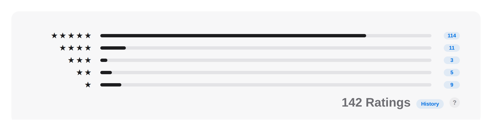
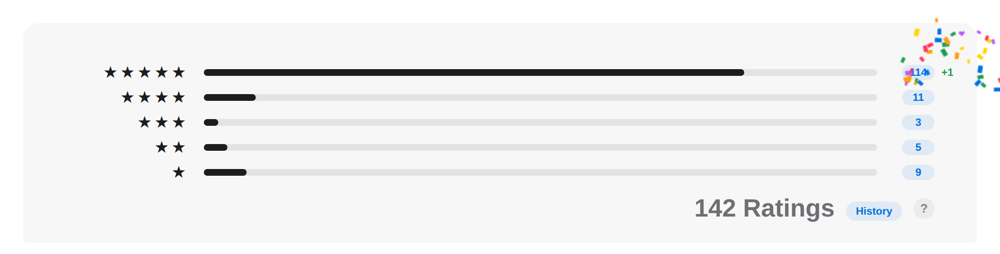
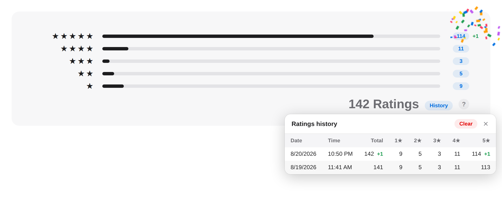

# App Store Connect Improvements

A tiny Chrome extension that makes App Store Connect a little less annoying. Right now it's one thing: a ratings helper that shows exact per-star counts and tracks how they change over time. More might show up later.

It's a vibe-coded mess — PRs welcome anyway.

| Exact counts | Change badges | History |
| --- | --- | --- |
|  |  |  |
| Apple only shows bars. Each bar gets a pill with the **exact number of ratings** for that star, recovered from the bar's full-precision width and the ratings total. | When a count changed since the last time you looked, a **+x / -x** badge appears next to it for the rest of the session. | The **History** button opens a table of every recorded change — date, time, total, and per-star counts, newest first. **Clear** wipes it. |

## Install

1. Clone or download this repo.
2. Open `chrome://extensions` in Chrome.
3. Enable **Developer mode** (top right).
4. Click **Load unpacked** and select this folder.

## Improvements

### Review Counter

Shows the **actual number of ratings per star** on the Ratings and Reviews page (`.../distribution/ratings/ios`). Apple only shows the bar chart, but each bar's fill element carries a full-precision width percentage. Combined with the total ("113 Ratings"), the exact per-star counts can be recovered. Each bar gets a count badge on the right, with a tooltip showing the percentage on hover.

Details:

- Watches the page for the star-rating rows (`div[role="img"]` with an aria-label like `5 Stars 80.5%`) — the chart loads asynchronously.
- Reads the full-precision bar width (e.g. `80.53097345132744%`), falling back to the aria-label percentage if the width attribute is malformed.
- Finds the "N Ratings" total in the same chart and apportions counts with the largest-remainder method so they always sum exactly to the total.

It also **tracks changes over time**:

- Every time you view the chart, the current per-star counts are compared with the last stored snapshot (kept in `chrome.storage.local`, keyed by app id). A new history row is stored **only when a number actually changed** — and only when you actually have the page open; nothing polls in the background.
- When a change is detected, each changed number gets a green `+x` / red `-x` delta next to its count pill for the rest of the page session. The badge hangs off the right edge of the row, so the bars keep their full width.
- A new 5-star rating gets confetti. Obviously. (Respects `prefers-reduced-motion`.)
- A **History** button under the "N Ratings" total opens a panel with a table of every recorded snapshot — date, time, total, and 1–5 star counts, newest first, with per-row deltas against the previous snapshot. History is capped at 500 rows per chart. A **Clear** button in the panel wipes the stored history for that app (with a confirm).
- History only tracks the unfiltered chart: snapshots, deltas, and the History button are active only while the territory picker shows **All Countries or Regions**. Filtered territories still get count pills, but never touch the stored history.

## Structure

```
manifest.json            MV3 manifest — lists every module's JS/CSS
src/core.js              module registry (loaded first)
src/main.js              runner — executes modules on load and on page mutations (loaded last)
src/modules/<name>.js    one file per improvement
src/modules/<name>.css   optional styles for an improvement
```

## Adding a new improvement

1. Create `src/modules/my-tweak.js`:

   ```js
   (() => {
     'use strict';

     function run() {
       // Find what you need in the DOM and tweak it. Must be idempotent —
       // this is called on load and again after every page mutation.
       // Mark any DOM you inject with the data-asc-ui attribute so the
       // shared MutationObserver ignores it.
     }

     window.ascImprovements.register({ id: 'my-tweak', run });
   })();
   ```

2. Add it to the `js` array in `manifest.json` (before `src/main.js`), plus a `css` entry if it has styles.
3. Reload the extension on `chrome://extensions`.

## License

MIT
